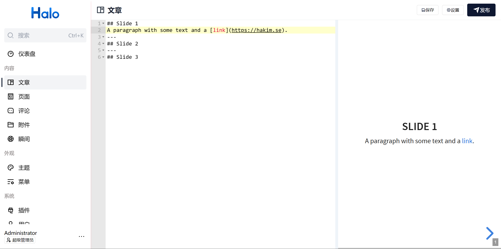

# plugin-revealjs

使用 [Ace](https://github.com/ajaxorg/ace) 编辑器和 [revealjs](https://github.com/hakimel/reveal.js) HTML Presentation Framework 构建的 Halo 文章编辑器，可以使用 Markdown 语法编辑出类似幻灯片形式的文章。

## 使用方式

1. 在 [Releases](https://github.com/wan92hen/plugin-revealjs/releases) 下载最新的 JAR 文件。
2. 在 Halo 后台的插件管理上传 JAR 文件进行安装。
3. 启动插件之后，即可在新建文章时选择此编辑器。

## 特殊语法

1. 使用 `---` 分割内容来创建新的横向幻灯片；
2. 使用 `--` 分割内容来创建新的纵向幻灯片。

其他语法请参考 reveal.js [官网文档](https://revealjs.com/markdown/)。
